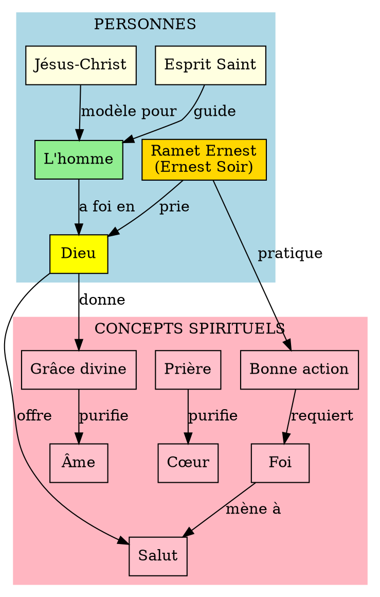

# Graphe de Connaissances - Journal de Guerre de Ramet Ernest

## 1. ENTITÉS EXTRAITES

### 1.1 Personnes (PERSON)

| ID | Nom | Alias | Type | Occurrences | Pages |
|----|-----|-------|------|-------------|-------|
| P001 | **Ramet Ernest** | Ernest Soir, R.E. | Auteur | ~200 | Toutes |
| P002 | **Dieu** | Seigneur, Père céleste, Créateur, Tout-Puissant | Divinité | ~300 | 12-91 |
| P003 | **L'homme** | Fidèle, Chrétien, Pécheur | Concept anthropologique | ~250 | 12-91 |
| P004 | **L'Esprit Saint** | Esprit divin, Esprit | Divinité | ~50 | 22-91 |
| P005 | **Le prochain** | Frère, Autrui | Concept social | ~40 | 25-76 |
| P006 | **Les esprits guides** | Esprits bons | Entités spirituelles | ~30 | 22-24 |
| P007 | **Saint Denis** | - | Saint | 1 | 79 |
| P008 | **Jésus-Christ** | Christ, Sauveur, Rédempteur | Divinité | ~15 | 43-64 |
| P009 | **Vierge Marie** | - | Sainte | 1 | 101-103 |
| P010 | **Abgar** | Roi d'Edesse | Figure historique | 1 | 101-103 |
| P011 | **Gecourtét** | - | Enseignant spirite | 1 | 1 |

### 1.2 Concepts Spirituels (CONCEPT)

| ID | Concept | Catégorie | Fréquence | Description |
|----|---------|-----------|-----------|-------------|
| C001 | **Bonne action** | Vertu | ~150 | Action vertueuse quotidienne |
| C002 | **Foi** | Vertu théologale | ~120 | Confiance en Dieu |
| C003 | **Prière** | Pratique | ~100 | Communion avec Dieu |
| C004 | **Grâce divine** | Don | ~80 | Aide surnaturelle de Dieu |
| C005 | **Âme** | Anthropologie | ~70 | Partie immortelle de l'homme |
| C006 | **Cœur** | Anthropologie | ~65 | Centre spirituel de l'homme |
| C007 | **Esprit** | Anthropologie | ~60 | Partie spirituelle |
| C008 | **Salut** | Eschatologie | ~50 | Vie éternelle avec Dieu |
| C009 | **Charité** | Vertu théologale | ~45 | Amour de Dieu et du prochain |
| C010 | **Humilité** | Vertu | ~40 | Reconnaissance de sa petitesse |
| C011 | **Persévérance** | Vertu | ~35 | Constance dans la foi |
| C012 | **Patience** | Vertu | ~30 | Acceptation des épreuves |
| C013 | **Bonheur** | État | ~50 | Béatitude spirituelle |
| C014 | **Péché** | Négativité | ~25 | Offense à Dieu |
| C015 | **Pardon** | Vertu | ~20 | Miséricorde |
| C016 | **Commandements** | Loi divine | ~25 | Préceptes de Dieu |
| C017 | **Vie éternelle** | Eschatologie | ~30 | Récompense finale |
| C018 | **Bonne mort** | Eschatologie | ~15 | Mort en état de grâce |
| C019 | **Épreuves** | Tribulations | ~25 | Difficultés de la vie |
| C020 | **Corps/Chair** | Anthropologie | ~20 | Partie matérielle |

### 1.3 Lieux (LOCATION)

| ID | Lieu | Type | Contexte |
|----|------|------|----------|
| L001 | **Martou Mephisto** | Ville (Allemagne) | Lieu de début d'études |
| L002 | **Etaples** | Commune (France) | Lettre militaire |
| L003 | **Saubourg** | Lieu | Lettre militaire |
| L004 | **Les Églises** | Institution religieuse | Prière universelle |
| L005 | **Le Ciel** | Lieu spirituel | Destination finale |
| L006 | **Le Paradis** | Lieu spirituel | Patrie des élus |

### 1.4 Objets (OBJECT)

| ID | Objet | Type | Signification |
|----|-------|------|---------------|
| O001 | **Carnet/Journal** | Document | Support d'écriture |
| O002 | **Sainte Face de Jésus** | Image pieuse | Objet de dévotion |
| O003 | **Image de la Vierge** | Image pieuse | Objet de dévotion |
| O004 | **Lettre militaire** | Document officiel | Témoignage historique |
| O005 | **Voile d'Abgar** | Relique | Référence historique |

### 1.5 Temps (TIME)

| ID | Date | Format | Événement |
|----|------|--------|-----------|
| T001 | 14 juin 1911 | JJ/MM/AAAA | Début études spirites |
| T002 | 16 juin 1911 | JJ/MM/AAAA | Page 30 |
| T003 | 18-20 août 1911 | Période | Pages 35-37 |
| T004 | 28-30 août 1911 | Période | Pages 47-48 |
| T005 | 9-11 septembre 1911 | Période | Pages 49-53 |
| T006 | 21 septembre 1911 | JJ/MM/AAAA | Page 56 |
| T007 | 1er octobre 1911 | JJ/MM/AAAA | Page 57 |
| T008 | 8 octobre 1911 | JJ/MM/AAAA | Page 61 |
| T009 | 11-23 janvier 1912 | Période | Pages 62-73 |
| T010 | 17 février 1912 | JJ/MM/AAAA | Page 74 |
| T011 | 15 février 1916 | JJ/MM/AAAA | Page 70 |
| T012 | 2 [?] 1917 | MM/AAAA | Page 80 (signature) |
| T013 | 15 mars 1917 | JJ/MM/AAAA | Page 81 |
| T014 | 31 juillet 1917 | JJ/MM/AAAA | Page 81 |
| T015 | 23 juillet 1917/18 | JJ/MM/AAAA | Page 91 |
| T016 | 29 août 1918 | JJ/MM/AAAA | Dernière leçon |

---

## 2. RELATIONS (TRIPLETS)

### 2.1 Relations Auteur-Document

```
(P001:Ramet_Ernest) --[ÉCRIT]--> (O001:Journal)
(P001:Ramet_Ernest) --[SIGNE_COMME]--> "R.E."
(P001:Ramet_Ernest) --[ALIAS]--> "Ernest Soir"
(P001:Ramet_Ernest) --[ÉTUDIE_AVEC]--> (P011:Gecourtét)
(P001:Ramet_Ernest) --[COMMENCE_À]--> (L001:Martou_Mephisto)
(P001:Ramet_Ernest) --[SOLDAT_DE]--> "Première Guerre Mondiale"
```

### 2.2 Relations Théologiques

```
(P003:L'homme) --[DOIT_AVOIR_FOI_EN]--> (P002:Dieu)
(P003:L'homme) --[REÇOIT_GRÂCE_DE]--> (P002:Dieu)
(P003:L'homme) --[PRIE]--> (P002:Dieu)
(P003:L'homme) --[POSSÈDE]--> (C005:Âme)
(P003:L'homme) --[POSSÈDE]--> (C006:Cœur)
(P003:L'homme) --[POSSÈDE]--> (C007:Esprit)
(P003:L'homme) --[POSSÈDE]--> (C020:Corps)

(P002:Dieu) --[DONNE]--> (C004:Grâce_divine)
(P002:Dieu) --[OFFRE]--> (C008:Salut)
(P002:Dieu) --[PROMET]--> (C017:Vie_éternelle)
(P002:Dieu) --[ÉTABLIT]--> (C016:Commandements)
(P002:Dieu) --[ACCORDE]--> (C015:Pardon)

(P004:Esprit_Saint) --[GUIDE]--> (P003:L'homme)
(P004:Esprit_Saint) --[SANCTIFIE]--> (C005:Âme)
(P004:Esprit_Saint) --[INSPIRE]--> (C003:Prière)

(P008:Jésus_Christ) --[MODÈLE_POUR]--> (P003:L'homme)
(P008:Jésus_Christ) --[SAUVE]--> (P003:L'homme)
(P008:Jésus_Christ) --[REPRÉSENTÉ_PAR]--> (O002:Sainte_Face)
```

### 2.3 Relations Vertus

```
(C001:Bonne_action) --[REQUIERT]--> (C010:Humilité)
(C001:Bonne_action) --[REQUIERT]--> (C009:Charité)
(C001:Bonne_action) --[REQUIERT]--> (C002:Foi)
(C001:Bonne_action) --[MÈNE_À]--> (C013:Bonheur)
(C001:Bonne_action) --[MÉRITE]--> (C004:Grâce_divine)

(C002:Foi) --[SOUTENUE_PAR]--> (C003:Prière)
(C002:Foi) --[PRODUIT]--> (C009:Charité)
(C002:Foi) --[MÈNE_À]--> (C008:Salut)
(C002:Foi) --[REQUIERT]--> (C011:Persévérance)

(C003:Prière) --[PURIFIE]--> (C006:Cœur)
(C003:Prière) --[FORTIFIE]--> (C005:Âme)
(C003:Prière) --[ATTIRE]--> (C004:Grâce_divine)
(C003:Prière) --[QUOTIDIENNE]--> "Pratique régulière"

(C009:Charité) --[ENVERS]--> (P005:Prochain)
(C009:Charité) --[IMITE]--> (P008:Jésus_Christ)
(C009:Charité) --[TÉMOIGNE_DE]--> (C002:Foi)

(C011:Persévérance) --[DANS]--> (C002:Foi)
(C011:Persévérance) --[JUSQU'À]--> (C018:Bonne_mort)
(C011:Persévérance) --[RÉCOMPENSÉE_PAR]--> (C017:Vie_éternelle)

(C012:Patience) --[DANS]--> (C019:Épreuves)
(C012:Patience) --[SANCTIFIE]--> (C005:Âme)
(C012:Patience) --[MÈNE_À]--> (C010:Humilité)
```

### 2.4 Relations Anthropologiques

```
(C005:Âme) --[IMMORTELLE]--> "Vérité fondamentale"
(C005:Âme) --[NOURRIE_PAR]--> (C003:Prière)
(C005:Âme) --[PURIFIÉE_PAR]--> (C004:Grâce_divine)
(C005:Âme) --[DESTINÉE_À]--> (C017:Vie_éternelle)

(C006:Cœur) --[DOIT_ÊTRE]--> "Pur"
(C006:Cœur) --[DOIT_ÊTRE]--> "Humble"
(C006:Cœur) --[CENTRE_DE]--> (C002:Foi)
(C006:Cœur) --[REÇOIT]--> (C004:Grâce_divine)

(C020:Corps) --[DOIT_SERVIR]--> (C007:Esprit)
(C020:Corps) --[NE_DOIT_PAS_DOMINER]--> (C005:Âme)
(C020:Corps) --[TEMPOREL]--> "Vérité fondamentale"
```

### 2.5 Relations Temporelles

```
(T001:14_juin_1911) --[DÉBUT_DE]--> "Études spirites"
(T011:15_février_1916) --[PENDANT]--> "WWI"
(T012:1917) --[SIGNATURE]--> "Ernest Soir"
(T016:29_août_1918) --[FIN_DE]--> (O001:Journal)
(T016:29_août_1918) --[AVANT]--> "Armistice (11/11/1918)"
```

---

## 3. ONTOLOGIE SIMPLIFIÉE

```
ÊTRE_SUPRÊME
├── Dieu (Père)
├── Jésus-Christ (Fils)
└── Esprit Saint

ÊTRE_HUMAIN
├── Ramet Ernest (auteur)
├── L'homme (concept générique)
└── Le prochain (autrui)

PARTIE_DE_L'HOMME
├── Âme (immortelle)
├── Esprit (spirituel)
├── Cœur (centre moral)
└── Corps/Chair (matériel)

VERTU_THÉOLOGALE
├── Foi
├── Espérance
└── Charité

VERTU_CARDINALE
├── Prudence
├── Justice
├── Force
└── Tempérance

VERTU_MORALE
├── Humilité
├── Patience
├── Persévérance
├── Pardon
└── Pureté

ACTION_SPIRITUELLE
├── Bonne action
├── Mauvaise action
├── Prière
├── Demande
└── Explication

CONCEPT_ESCHATOLOGIQUE
├── Salut
├── Vie éternelle
├── Bonne mort
├── Jugement
└── Récompense

CONTEXTE_HISTORIQUE
├── WWI (1914-1918)
├── Spiritisme (1911)
├── Foi catholique
└── Service militaire
```

---

## 4. STATISTIQUES

### Fréquence des concepts principaux :
- **Bonne action** : ~150 occurrences
- **L'homme** : ~250 occurrences
- **Dieu** : ~300 occurrences
- **Foi** : ~120 occurrences
- **Prière** : ~100 occurrences
- **Grâce** : ~80 occurrences
- **Âme** : ~70 occurrences
- **Cœur** : ~65 occurrences
- **Esprit** : ~60 occurrences
- **Salut** : ~50 occurrences
- **Bonheur** : ~50 occurrences
- **Charité** : ~45 occurrences

### Distribution thématique par section :
- **Pages 1-11** : Spiritisme initial (10%)
- **Pages 12-21** : Transition (10%)
- **Pages 22-51** : Vertus quotidiennes (30%)
- **Pages 52-71** : Humilité et famille (20%)
- **Pages 72-81** : Témoignage de foi (10%)
- **Pages 82-91** : Persévérance finale (10%)
- **Pages 92-103** : Documents annexes (10%)

---

## 5. GRAPHE VISUEL (Format DOT)



---

## 6. REQUÊTES POSSIBLES

### Exemples de questions auxquelles le graphe peut répondre :

1. **Qui est l'auteur du journal ?**
   → Ramet Ernest (alias Ernest Soir, signature R.E.)

2. **Quelles vertus sont les plus mentionnées ?**
   → Foi, Charité, Humilité, Patience, Persévérance

3. **Quelle est la relation entre l'homme et Dieu ?**
   → Foi → Prière → Grâce → Salut

4. **Quelles sont les parties de l'homme mentionnées ?**
   → Âme, Esprit, Cœur, Corps/Chair

5. **Quelle est la chronologie du journal ?**
   → 1911 (début spirite) → 1912 → 1916 → 1917 → 1918 (fin)

6. **Quel est le chemin vers le salut selon le journal ?**
   → Bonne action + Foi + Prière + Persévérance → Grâce divine → Bonne mort → Vie éternelle

7. **Quelles personnes spirituelles sont mentionnées ?**
   → Dieu, Jésus-Christ, Esprit Saint, Vierge Marie, Saint Denis

---

*Graphe de connaissances créé le 16 novembre 2025*
*Basé sur l'analyse de 91 pages transcrites du Journal de Guerre*
*Total : 11 personnes, 20 concepts, 6 lieux, 5 objets, 16 dates*
