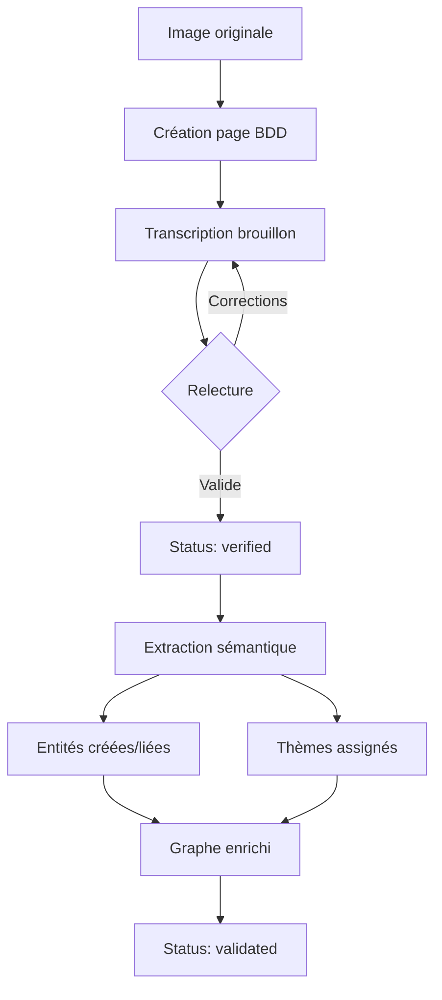
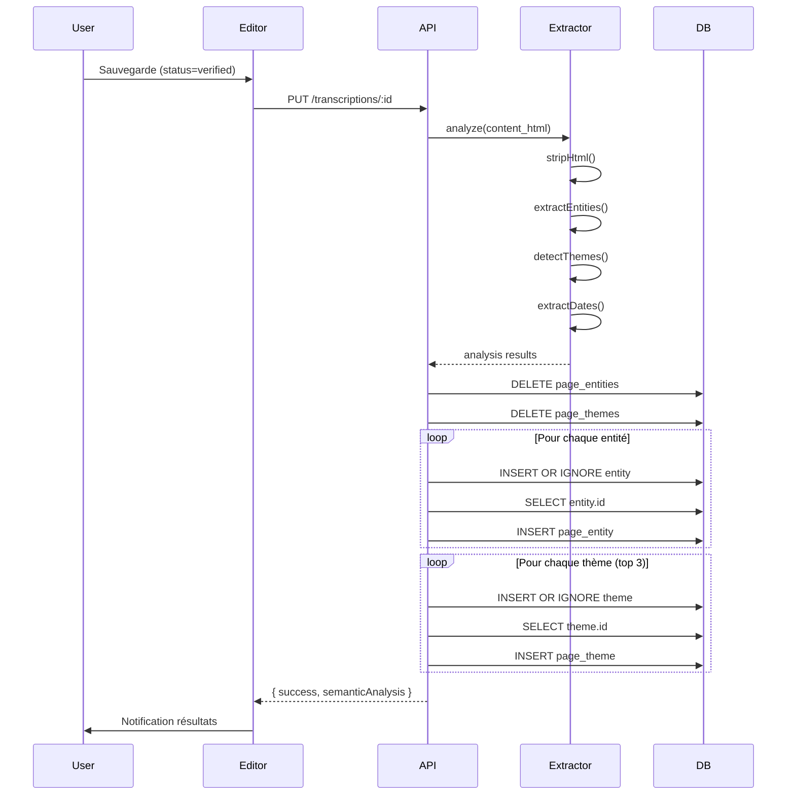
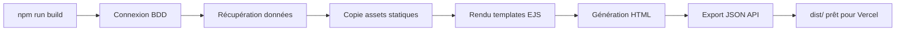

# Spécification Technique - Journal de Guerre

## Application Web pour la Préservation et l'Analyse du Journal de Ramet Ernest (1918)

**Version** : 2.0.0
**Date** : Novembre 2025
**Auteur** : Projet de préservation du patrimoine historique

---

## Table des Matières

1. [Vue d'ensemble](#1-vue-densemble)
2. [Architecture Technique](#2-architecture-technique)
3. [Espaces Fonctionnels](#3-espaces-fonctionnels)
4. [Système d'Ontologie](#4-système-dontologie)
5. [Base de Données](#5-base-de-données)
6. [API REST](#6-api-rest)
7. [Frontend](#7-frontend)
8. [Déploiement](#8-déploiement)
9. [Structure des Fichiers](#9-structure-des-fichiers)
10. [Flux de Données](#10-flux-de-données)

---

## 1. Vue d'ensemble

### 1.1 Description du Projet

Application web dédiée à la numérisation, transcription et analyse sémantique d'un journal de prisonnier de guerre français. Le journal comprend **103 pages** écrites par Ramet Ernest en juin 1918 au camp de Munster (Westphalie, Allemagne).

### 1.2 Objectifs

- **Préservation** : Numérisation haute qualité des pages manuscrites
- **Accessibilité** : Interface de lecture immersive
- **Transcription** : Édition collaborative avec validation
- **Analyse** : Extraction sémantique et graphe de connaissances
- **Recherche** : Moteur de recherche plein texte

### 1.3 Contenu Historique

- **Auteur** : Ramet Ernest (signatures : R.E., R.E.C., R.E.E., R.E.D., "Ernest Soir")
- **Période couverte** : 1911-1918 (notes recopiées pendant la captivité)
- **Thèmes** : Spiritisme, foi chrétienne, vertus morales, captivité
- **Structure** :
  - Pages 1-11 : Enseignements spirites
  - Pages 12-91 : Journal dévotionnel quotidien
  - Pages 92-103 : Annexes et documents militaires

---

## 2. Architecture Technique

### 2.1 Stack Technologique

| Composant | Technologie | Version |
|-----------|-------------|---------|
| **Runtime** | Node.js | 18+ |
| **Framework Backend** | Express.js | 4.18.2 |
| **Base de données** | SQLite | 3.x |
| **Driver SQLite** | better-sqlite3 | 9.2.2 |
| **Templating** | EJS | 3.1.9 |
| **Visualisation** | D3.js | 7.x |
| **Frontend** | Vanilla JavaScript | ES6+ |
| **CSS** | CSS3 avec variables | - |
| **Déploiement** | Vercel (statique) | - |

### 2.2 Modes de Fonctionnement

#### Mode Développement (Local)
```bash
npm install
npm run init-db    # Création des tables
npm run migrate    # Import des données
npm start          # Serveur sur port 3000
```

- Base de données SQLite en lecture/écriture
- API REST complète
- Édition des transcriptions
- Extraction sémantique automatique

#### Mode Production (Vercel)
```bash
npm run build      # Génère /dist
# Déploiement automatique via GitHub
```

- Site statique pré-généré
- Pas d'édition possible
- API export en JSON statique
- Cache CDN optimisé

### 2.3 Dépendances

```json
{
  "dependencies": {
    "express": "^4.18.2",
    "ejs": "^3.1.9",
    "better-sqlite3": "^9.2.2"
  },
  "devDependencies": {}
}
```

---

## 3. Espaces Fonctionnels

### 3.1 Espace Journal (Lecture)

**Route** : `/journal`
**Fichiers** : `src/routes/journal.js`, `src/views/journal/*.ejs`

#### Fonctionnalités
- Visionneuse plein écran avec zoom
- Navigation par miniatures cliquables
- Mode nuit (thème sombre)
- Transcription annotée en overlay
- Navigation page précédente/suivante
- Indicateur de progression

#### Interface Utilisateur
- Image haute résolution centrée
- Panneau latéral des miniatures
- Boutons de contrôle (zoom, plein écran)
- Affichage conditionnel de la transcription
- Responsive design pour mobile

### 3.2 Espace Archives (Préservation)

**Route** : `/archives`
**Fichiers** : `src/routes/archives.js`, `src/views/archives/*.ejs`

#### Fonctionnalités
- Liste des pages avec statut de transcription
- Statistiques globales (brouillons, vérifiées, validées)
- Éditeur de transcription complet
- Outils de manipulation d'image
- Système de validation en 3 étapes
- Extraction sémantique automatique

#### Éditeur de Page (`/archives/edit/:id`)

**Panneau Image**
- Rotation (gauche/droite par pas de 90°)
- Zoom (0.5x à 3x)
- Luminosité (50% à 150%)
- Contraste (50% à 150%)
- Recadrage (prévu, non implémenté)
- Réinitialisation des paramètres

**Panneau Transcription**
- Onglet Transcription : Éditeur HTML avec formatage
- Onglet Ontologie : Analyse sémantique interactive
- Onglet Notes : Zone de texte pour incertitudes
- Onglet Métadonnées : Titre, description, date

**Outils de Formatage HTML**
- Gras (`<strong>`)
- Italique (`<em>`)
- Titre (`<h4>`)
- Liste (`<ul><li>`)
- Paragraphe (`<p>`)

**Workflow de Validation**
1. **Brouillon** (draft) : Transcription initiale
2. **Vérifié** (verified) : Relu et corrigé
3. **Validé** (validated) : Approuvé définitivement

**Sauvegarde Automatique**
- Raccourci clavier Ctrl+S
- Extraction sémantique si status ≥ verified
- Notification des entités extraites
- Versionnement des modifications

### 3.3 Espace Étude (Analyse)

**Route** : `/etude`
**Fichiers** : `src/routes/etude.js`, `src/views/etude/*.ejs`

#### Fonctionnalités
- Contexte historique détaillé
- Recherche plein texte dans les transcriptions
- Graphe de connaissances interactif
- Explorateur d'ontologie
- Chronologie interactive
- Export des données en JSON

#### Graphe de Connaissances
- Visualisation D3.js force-directed
- Nœuds colorés par type (personne, concept, lieu, thème)
- Arêtes représentant les relations
- Zoom et panoramique
- Filtrage par catégorie
- Panneau d'information au clic
- Légende interactive

#### Explorateur d'Ontologie
- Vue hiérarchique des concepts
- Table des relations
- Statistiques (entités, thèmes, relations)
- Navigation par catégories

#### Recherche
- Formulaire de recherche simple
- Résultats avec extraits contextuels
- Liens directs vers les pages

---

## 4. Système d'Ontologie

### 4.1 Architecture

**Fichiers clés** :
- `data/ontology.json` : Données ontologiques structurées
- `src/services/ontology-extractor.js` : Service d'extraction
- `src/routes/ontology.js` : API REST
- `src/public/js/ontology-panel.js` : UI éditeur
- `src/public/js/knowledge-graph.js` : Visualisation graphe

### 4.2 Structure des Données

```javascript
{
  "version": "2.0.0",
  "lastUpdated": "ISO8601",
  "entities": {
    "persons": [
      {
        "id": "P001",
        "name": "Ramet Ernest",
        "aliases": ["Ernest Soir", "R.E."],
        "type": "Auteur",
        "description": "...",
        "frequency": 200,
        "patterns": ["Ramet Ernest", "R\\.E\\."]
      }
    ],
    "concepts": [...],
    "places": [...],
    "objects": [...]
  },
  "themes": [
    {
      "id": "T001",
      "name": "Spiritisme",
      "description": "...",
      "color": "#9B59B6",
      "keywords": ["spiritisme", "médium", "incarnation"]
    }
  ],
  "relations": [
    {
      "id": "R001",
      "type": "REQUIERT",
      "source": "C001",
      "target": "C010",
      "description": "Bonne action requiert Humilité"
    }
  ],
  "hierarchy": {
    "ÊTRE_SUPRÊME": ["P002", "P008", "P004"],
    "VERTU_THÉOLOGALE": ["C002", "C009"],
    "ESCHATOLOGIE": ["C008", "C017", "C018"]
  }
}
```

### 4.3 Entités Prédéfinies

#### Personnes (11)
| ID | Nom | Type | Fréquence |
|----|-----|------|-----------|
| P001 | Ramet Ernest | Auteur | ~200 |
| P002 | Dieu | Divinité | ~300 |
| P003 | L'homme | Concept anthropologique | ~250 |
| P004 | Esprit Saint | Divinité | ~50 |
| P005 | Le prochain | Concept social | ~40 |
| P006 | Les esprits guides | Entités spirituelles | ~30 |
| P007 | Saint Denis | Saint | 1 |
| P008 | Jésus-Christ | Divinité | ~15 |
| P009 | Vierge Marie | Sainte | ~5 |
| P010 | Abgar | Figure historique | 1 |
| P011 | Legar larre | Enseignant spirite | 1 |

#### Concepts (23)
- **Vertus théologales** : Foi, Charité
- **Vertus morales** : Humilité, Patience, Persévérance, Pardon
- **Anthropologie spirituelle** : Âme, Cœur, Esprit, Corps
- **Eschatologie** : Salut, Vie éternelle, Bonne mort
- **Pratiques** : Prière, Bonne action
- **Spiritisme** : Incarnation, Désincarnation, Réincarnation

#### Lieux (5)
- Munster Westphalie (Camp de prisonniers)
- Dunkerque (France)
- Guémicourt (France)
- Etaples (France)
- Le Ciel (Lieu spirituel)

### 4.4 Thèmes (6)

| Thème | Couleur | Mots-clés |
|-------|---------|-----------|
| Spiritisme | #9B59B6 | spiritisme, médium, incarnation |
| Foi chrétienne | #3498DB | foi, Dieu, prière, Christ |
| Vertus morales | #27AE60 | vertu, humilité, charité |
| Captivité | #E74C3C | prisonnier, camp, Munster |
| Introspection | #F39C12 | réflexion, méditation, conscience |
| Eschatologie | #1ABC9C | mort, vie éternelle, salut |

### 4.5 Relations (16)

Types de relations :
- **REQUIERT** : Bonne action → Humilité
- **MÈNE_À** : Foi → Salut
- **DONNE** : Dieu → Grâce
- **OFFRE** : Dieu → Salut
- **PURIFIE** : Prière → Cœur
- **FORTIFIE** : Prière → Âme
- **GUIDE** : Esprit Saint → L'Homme
- **MODÈLE_POUR** : Jésus-Christ → L'Homme
- **ÉCRIT** : Ramet Ernest → Carnet
- **POSSÈDE** : L'Homme → Âme/Cœur/Esprit/Corps
- **ENVERS** : Charité → Le Prochain
- **PRISONNIER_À** : Ramet Ernest → Munster

### 4.6 Algorithme d'Extraction

```javascript
class OntologyExtractor {
  analyze(text) {
    const plainText = this.stripHtml(text);

    return {
      entities: this.extractEntities(plainText),
      themes: this.detectThemes(plainText),
      dates: this.extractDates(plainText),
      statistics: {...},
      summary: {...}
    };
  }

  extractEntities(text) {
    // Pour chaque entité dans ontology.json
    // - Normaliser le texte (accents, casse)
    // - Matcher les patterns regex
    // - Compter les occurrences
    // - Calculer la confiance
  }

  detectThemes(text) {
    // Pour chaque thème
    // - Chercher les mots-clés
    // - Calculer un score
    // - Trier par pertinence
  }

  extractDates(text) {
    // Patterns français :
    // "14 juin 1918"
    // "1er octobre 1911"
    // "1918"
  }
}
```

### 4.7 Enrichissement Automatique

Lors de la sauvegarde d'une transcription avec status `verified` ou `validated` :

1. **Extraction** : Analyse du texte brut
2. **Nettoyage** : Suppression des anciennes relations page-entité
3. **Insertion** : Création des nouvelles entités si nécessaire
4. **Liaison** : Association page ↔ entité avec comptage
5. **Thématisation** : Attribution des 3 thèmes principaux
6. **Feedback** : Notification à l'utilisateur

---

## 5. Base de Données

### 5.1 Schéma SQLite

```sql
-- Pages du journal
CREATE TABLE pages (
  id INTEGER PRIMARY KEY AUTOINCREMENT,
  image_number INTEGER UNIQUE NOT NULL,
  page_number INTEGER NOT NULL,
  image_path TEXT NOT NULL,
  title TEXT,
  description TEXT,
  date_written TEXT,
  period TEXT,
  created_at DATETIME DEFAULT CURRENT_TIMESTAMP
);

-- Transcriptions
CREATE TABLE transcriptions (
  id INTEGER PRIMARY KEY AUTOINCREMENT,
  page_id INTEGER UNIQUE NOT NULL,
  content TEXT,
  content_html TEXT,
  status TEXT DEFAULT 'draft' CHECK(status IN ('draft', 'verified', 'validated')),
  transcriptor_notes TEXT,
  version INTEGER DEFAULT 1,
  created_at DATETIME DEFAULT CURRENT_TIMESTAMP,
  updated_at DATETIME DEFAULT CURRENT_TIMESTAMP,
  FOREIGN KEY (page_id) REFERENCES pages(id)
);

-- Annotations visuelles
CREATE TABLE annotations (
  id INTEGER PRIMARY KEY AUTOINCREMENT,
  page_id INTEGER NOT NULL,
  type TEXT NOT NULL,
  x REAL, y REAL,
  width REAL, height REAL,
  color TEXT,
  text TEXT,
  created_at DATETIME DEFAULT CURRENT_TIMESTAMP,
  FOREIGN KEY (page_id) REFERENCES pages(id)
);

-- Ajustements d'image
CREATE TABLE image_adjustments (
  id INTEGER PRIMARY KEY AUTOINCREMENT,
  page_id INTEGER UNIQUE NOT NULL,
  rotation INTEGER DEFAULT 0,
  crop_x REAL DEFAULT 0,
  crop_y REAL DEFAULT 0,
  crop_width REAL DEFAULT 100,
  crop_height REAL DEFAULT 100,
  brightness INTEGER DEFAULT 100,
  contrast INTEGER DEFAULT 100,
  updated_at DATETIME DEFAULT CURRENT_TIMESTAMP,
  FOREIGN KEY (page_id) REFERENCES pages(id)
);

-- Entités sémantiques
CREATE TABLE entities (
  id INTEGER PRIMARY KEY AUTOINCREMENT,
  type TEXT NOT NULL CHECK(type IN ('person', 'place', 'concept', 'date')),
  name TEXT NOT NULL,
  description TEXT,
  created_at DATETIME DEFAULT CURRENT_TIMESTAMP,
  UNIQUE(type, name)
);

-- Thèmes
CREATE TABLE themes (
  id INTEGER PRIMARY KEY AUTOINCREMENT,
  name TEXT UNIQUE NOT NULL,
  description TEXT,
  color TEXT DEFAULT '#8B4513',
  created_at DATETIME DEFAULT CURRENT_TIMESTAMP
);

-- Relations page ↔ entité
CREATE TABLE page_entities (
  page_id INTEGER NOT NULL,
  entity_id INTEGER NOT NULL,
  mention_count INTEGER DEFAULT 1,
  PRIMARY KEY (page_id, entity_id),
  FOREIGN KEY (page_id) REFERENCES pages(id),
  FOREIGN KEY (entity_id) REFERENCES entities(id)
);

-- Relations page ↔ thème
CREATE TABLE page_themes (
  page_id INTEGER NOT NULL,
  theme_id INTEGER NOT NULL,
  PRIMARY KEY (page_id, theme_id),
  FOREIGN KEY (page_id) REFERENCES pages(id),
  FOREIGN KEY (theme_id) REFERENCES themes(id)
);
```

### 5.2 Indexes

```sql
CREATE INDEX idx_pages_image ON pages(image_number);
CREATE INDEX idx_transcriptions_status ON transcriptions(status);
CREATE INDEX idx_entities_type ON entities(type);
CREATE INDEX idx_page_entities_entity ON page_entities(entity_id);
```

### 5.3 Migration des Données

Le script `scripts/migrate-data.js` :
1. Importe les 103 pages (IMG_0410 à IMG_0512)
2. Crée les transcriptions initiales
3. Insère les entités de base
4. Définit les thèmes par défaut
5. Établit les relations initiales

---

## 6. API REST

### 6.1 Endpoints Principaux

#### Pages
```
GET  /api/pages                    # Liste toutes les pages
GET  /api/pages/:id                # Détails d'une page
```

#### Transcriptions
```
PUT  /api/transcriptions/:pageId   # Met à jour une transcription
Body: {
  content_html: string,
  transcriptor_notes: string,
  status: 'draft' | 'verified' | 'validated',
  auto_extract: boolean
}
Response: {
  success: boolean,
  changes: number,
  semanticAnalysis: {
    entitiesExtracted: { persons, concepts, places },
    themesDetected: string[],
    dates: Date[]
  }
}
```

#### Ajustements Image
```
PUT  /api/adjustments/:pageId
Body: {
  rotation: number,
  crop_x: number,
  crop_y: number,
  crop_width: number,
  crop_height: number,
  brightness: number,
  contrast: number
}
```

#### Annotations
```
POST   /api/annotations            # Créer une annotation
DELETE /api/annotations/:id        # Supprimer une annotation
```

#### Export & Statistiques
```
GET  /api/export                   # Export JSON complet
GET  /api/stats                    # Statistiques globales
```

### 6.2 Endpoints Ontologie

```
GET  /api/ontology                 # Ontologie complète
GET  /api/ontology/entities/:type  # Entités par type
GET  /api/ontology/themes          # Tous les thèmes
GET  /api/ontology/relations       # Toutes les relations
GET  /api/ontology/hierarchy       # Structure hiérarchique
GET  /api/ontology/graph           # Données pour D3.js
GET  /api/ontology/statistics      # Stats de l'ontologie

POST /api/ontology/analyze         # Analyser un texte
Body: { text: string }
Response: {
  entities: { persons, concepts, places, objects },
  themes: Theme[],
  dates: Date[],
  statistics: {...},
  summary: {...},
  analyzedAt: ISO8601
}

POST /api/ontology/extract-entities
POST /api/ontology/detect-themes
POST /api/ontology/suggest-relations
POST /api/ontology/entities/:type  # Ajouter une entité
POST /api/ontology/themes          # Ajouter un thème
POST /api/ontology/reload          # Recharger depuis fichier
```

### 6.3 Gestion des Erreurs

```javascript
{
  success: false,
  error: "Message d'erreur"
}
```

Codes HTTP :
- 200 : Succès
- 400 : Requête invalide
- 404 : Ressource non trouvée
- 500 : Erreur serveur

---

## 7. Frontend

### 7.1 Architecture CSS

**Fichiers** :
- `src/public/css/main.css` : Variables globales, reset, utilitaires
- `src/public/css/portal.css` : Page d'accueil
- `src/public/css/journal.css` : Espace lecture
- `src/public/css/archives.css` : Espace préservation
- `src/public/css/editor.css` : Éditeur de transcription
- `src/public/css/etude.css` : Espace analyse
- `src/public/css/ontology.css` : Composants ontologie

**Variables CSS** :
```css
:root {
  --color-primary: #8B4513;
  --color-primary-dark: #654321;
  --color-accent: #D4AF37;
  --color-surface: #FFFFFF;
  --color-background: #F5F5DC;
  --color-text: #2C1810;
  --color-text-muted: #6B5A4E;
  --color-border: #D4C5B0;

  --space-xs: 0.25rem;
  --space-sm: 0.5rem;
  --space-md: 1rem;
  --space-lg: 1.5rem;
  --space-xl: 2rem;
  --space-2xl: 3rem;
  --space-3xl: 4rem;

  --radius-sm: 4px;
  --radius-md: 8px;
  --radius-lg: 12px;
  --radius-xl: 16px;
  --radius-full: 9999px;

  --shadow-sm: 0 1px 2px rgba(0,0,0,0.1);
  --shadow-md: 0 4px 6px rgba(0,0,0,0.1);
  --shadow-lg: 0 10px 15px rgba(0,0,0,0.1);

  --transition-fast: 150ms ease;
  --transition-normal: 300ms ease;
}
```

### 7.2 Architecture JavaScript

**Fichiers** :
- `src/public/js/main.js` : Utilitaires globaux (Utils)
- `src/public/js/portal.js` : Animations page d'accueil
- `src/public/js/journal.js` : Visionneuse de pages
- `src/public/js/archives.js` : Gestion liste archives
- `src/public/js/editor.js` : Éditeur complet
- `src/public/js/etude.js` : Interactions page étude
- `src/public/js/ontology-panel.js` : Panneau d'analyse sémantique
- `src/public/js/knowledge-graph.js` : Visualisation D3.js

**Utilitaires Globaux** :
```javascript
window.Utils = {
  api: async (endpoint, options) => {...},
  debounce: (func, wait) => {...},
  notify: (message, type) => {...},
  formatDate: (date) => {...}
};
```

### 7.3 Templating EJS

**Partials** :
- `src/views/partials/head.ejs` : `<head>`, CSS, meta
- `src/views/partials/nav.ejs` : Navigation principale
- `src/views/partials/footer.ejs` : `</body>`, scripts JS

**Variables de Template** :
```javascript
{
  title: string,
  additionalCss: string[],
  additionalJs: string[],
  activePage: string,
  // + données spécifiques à la page
}
```

### 7.4 Responsive Design

Breakpoints :
- Mobile : < 768px
- Tablet : 768px - 1024px
- Desktop : > 1024px

Adaptations :
- Navigation en hamburger menu sur mobile
- Grilles flexibles (auto-fit, minmax)
- Taille de police responsive
- Images fluides
- Touch-friendly (44px minimum)

---

## 8. Déploiement

### 8.1 Configuration Vercel

**vercel.json** :
```json
{
  "version": 2,
  "name": "journal-de-guerre",
  "buildCommand": "npm run build",
  "outputDirectory": "dist",
  "installCommand": "npm install",
  "public": true,
  "cleanUrls": true,
  "trailingSlash": false,
  "headers": [
    {
      "source": "/(.*)",
      "headers": [
        { "key": "X-Content-Type-Options", "value": "nosniff" },
        { "key": "X-Frame-Options", "value": "DENY" }
      ]
    },
    {
      "source": "/jpg_web/(.*)",
      "headers": [
        { "key": "Cache-Control", "value": "public, max-age=31536000, immutable" }
      ]
    }
  ],
  "rewrites": [
    { "source": "/journal/page/:num", "destination": "/journal/page/:num.html" },
    { "source": "/api/export", "destination": "/api/export.json" }
  ]
}
```

### 8.2 Build Statique

Le script `scripts/build-static.js` génère :

```
dist/
├── index.html                    # Page d'accueil
├── 404.html                      # Page erreur
├── css/                          # Styles copiés
├── js/                           # Scripts copiés
├── jpg_web/                      # Images copiées
├── journal/
│   ├── index.html               # Index journal
│   └── page/
│       ├── 1.html               # Pages individuelles
│       ├── 2.html
│       └── ...103.html
├── archives/
│   ├── index.html               # Liste archives
│   └── edit/
│       └── index.html           # Notice "non disponible"
├── etude/
│   ├── index.html               # Page étude
│   └── search.html              # Recherche (statique)
└── api/
    └── export.json              # Export données complet
```

### 8.3 Limitations Mode Statique

- Pas d'édition des transcriptions
- Pas de sauvegarde des ajustements
- Pas de recherche dynamique
- Pas d'extraction sémantique
- API en lecture seule (JSON pré-généré)

---

## 9. Structure des Fichiers

```
journal_de_guerre/
├── server.js                     # Serveur Express principal
├── package.json                  # Configuration Node.js
├── vercel.json                   # Configuration Vercel
├── spec_app.md                   # Ce document
├── README-v2.md                  # Documentation utilisateur
├── CLAUDE.md                     # Instructions IA
├── knowledge_graph.md            # Graphe de connaissances original
├── ANALYSE_COMPLETE_JOURNAL.md   # Analyse détaillée
├── synthese_journal.md           # Synthèse du contenu
│
├── data/
│   ├── journal.db                # Base SQLite (gitignored)
│   └── ontology.json             # Données ontologiques
│
├── scripts/
│   ├── init-database.js          # Création des tables
│   ├── migrate-data.js           # Import initial
│   └── build-static.js           # Génération statique
│
├── src/
│   ├── routes/
│   │   ├── index.js              # Route /
│   │   ├── journal.js            # Routes /journal/*
│   │   ├── archives.js           # Routes /archives/*
│   │   ├── etude.js              # Routes /etude/*
│   │   ├── api.js                # Routes /api/*
│   │   └── ontology.js           # Routes /api/ontology/*
│   │
│   ├── services/
│   │   └── ontology-extractor.js # Service d'extraction
│   │
│   ├── views/
│   │   ├── index.ejs             # Page d'accueil
│   │   ├── 404.ejs               # Page erreur
│   │   ├── error.ejs             # Page erreur serveur
│   │   ├── partials/
│   │   │   ├── head.ejs          # En-tête HTML
│   │   │   ├── nav.ejs           # Navigation
│   │   │   └── footer.ejs        # Pied de page
│   │   ├── journal/
│   │   │   ├── index.ejs         # Liste pages
│   │   │   └── page.ejs          # Page individuelle
│   │   ├── archives/
│   │   │   ├── index.ejs         # Liste archives
│   │   │   └── edit.ejs          # Éditeur
│   │   └── etude/
│   │       ├── index.ejs         # Page principale
│   │       └── search.ejs        # Résultats recherche
│   │
│   └── public/
│       ├── css/
│       │   ├── main.css          # Styles globaux
│       │   ├── portal.css        # Accueil
│       │   ├── journal.css       # Lecture
│       │   ├── archives.css      # Archives
│       │   ├── editor.css        # Éditeur
│       │   ├── etude.css         # Étude
│       │   └── ontology.css      # Ontologie
│       └── js/
│           ├── main.js           # Utilitaires
│           ├── portal.js         # Accueil
│           ├── journal.js        # Lecture
│           ├── archives.js       # Archives
│           ├── editor.js         # Éditeur
│           ├── etude.js          # Étude
│           ├── ontology-panel.js # Panel ontologie
│           └── knowledge-graph.js # Graphe D3
│
├── jpg_web/                      # Images du journal
│   ├── IMG_0410.JPG             # Pages 1-103
│   ├── IMG_0411.JPG
│   └── ...IMG_0512.JPG
│
└── dist/                         # Build statique (gitignored)
```

---

## 10. Flux de Données

### 10.1 Workflow de Transcription



### 10.2 Extraction Sémantique



### 10.3 Build Statique



---

## Annexes

### A. Commandes NPM

```bash
npm start          # Démarre le serveur (port 3000)
npm run dev        # Mode développement avec nodemon
npm run init-db    # Initialise la base de données
npm run migrate    # Importe les données existantes
npm run build      # Génère le site statique
```

### B. Variables d'Environnement

```bash
PORT=3000          # Port du serveur (défaut: 3000)
NODE_ENV=development|production
```

### C. Ressources Externes

- **D3.js** : https://d3js.org/d3.v7.min.js
- **Font Awesome** : Icônes (via CDN)
- **Google Fonts** : Typographies (optionnel)

### D. Sécurité

- Headers de sécurité (X-Content-Type-Options, X-Frame-Options)
- Sanitisation des entrées HTML
- Prepared statements SQL
- Pas d'authentification (mono-utilisateur local)
- CORS non configuré (même origine)

### E. Performance

- Cache immutable pour images (1 an)
- Cache journalier pour CSS/JS
- SQLite WAL mode
- Lazy loading des onglets ontologie
- Debounce sur la preview HTML
- Build statique pour CDN

### F. Évolutions Futures

1. **Authentification** multi-utilisateur
2. **Historique** des modifications (git-like)
3. **Recherche avancée** avec filtres
4. **OCR automatique** (Tesseract/Vision API)
5. **Export PDF** des transcriptions
6. **Annotations collaboratives**
7. **NLP avancé** (NER, sentiment analysis)
8. **API GraphQL** pour requêtes complexes
9. **PWA** pour usage hors-ligne
10. **i18n** pour internationalisation

---

**Fin du document de spécification**

*Journal de Guerre - Ramet Ernest (1918)*
*Version 2.0.0 - Architecture à 3 espaces avec système d'ontologie*
